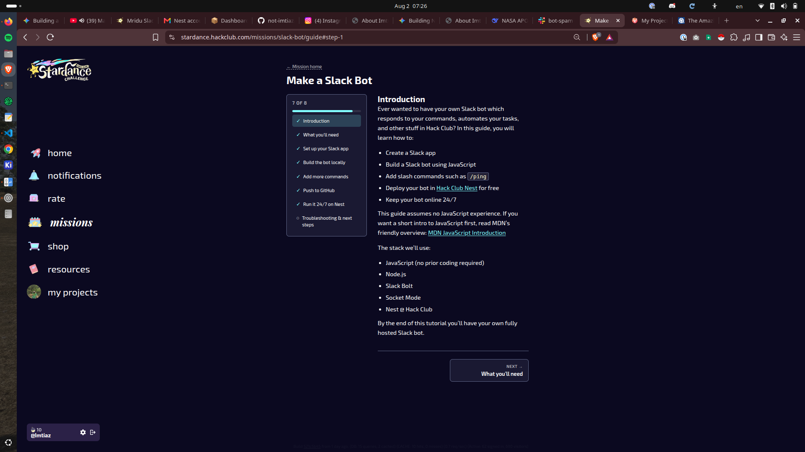
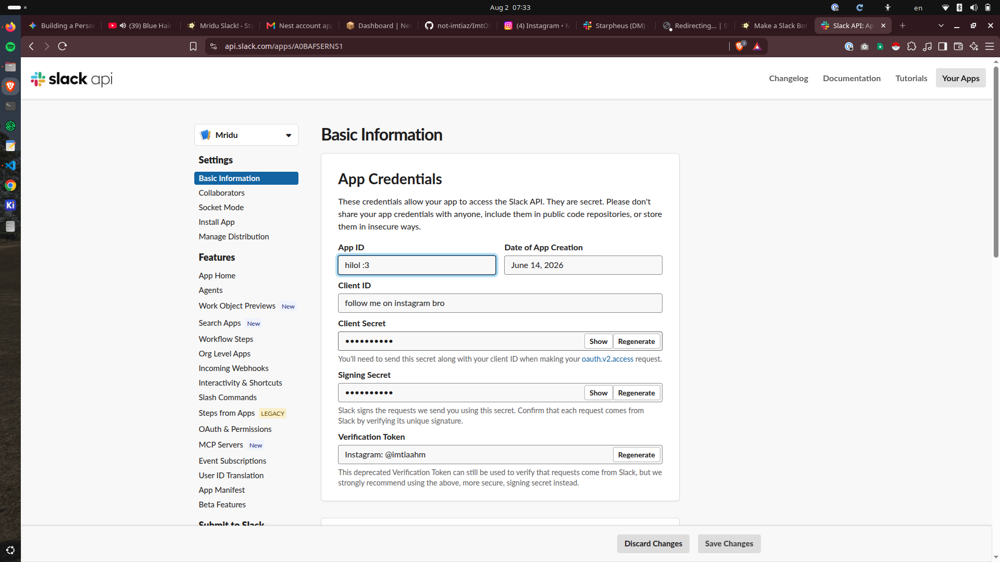
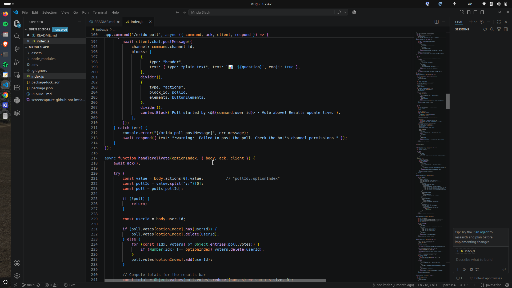
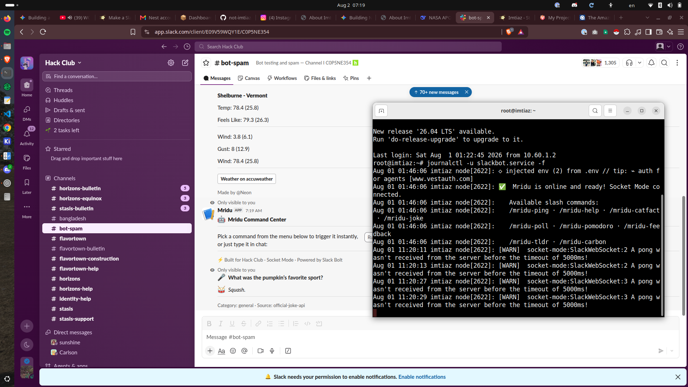

# Mridu Slack Bot

Mridu is a friend of mine and while making this bot, I was talking to Mridu and that made me name this bot after her.
Making this bot wasn't that hard as Hack Club provided a guide.


as you can see, hack club provided a guide for us to create a bot and that's what I used.

as the guide intended, i went to https://api.slack.com/apps and created an app named Mridu,
then enabled socket mode, and set perms to the bot.
set bot token scopes.

then i installed the bot in hack clubs workspace.


took the infos and saved them somewhere.
then i added my first commands [/mridu-ping].

then i created a project on vs code, opened terminal and run some npm install commands.
stored all the infos in the .env file.

then created index.js and put this
```index.js
require("dotenv").config();

const { App } = require("@slack/bolt");

const app = new App({
  token: process.env.SLACK_BOT_TOKEN,
  appToken: process.env.SLACK_APP_TOKEN,
  socketMode: true
});

app.command("/mridu-ping", async ({ command, ack, respond }) => {
  const start = Date.now();
  await ack();
  const latency = Date.now() - start;
  await respond({ text: `Pong!\nLatency: ${latency}ms` });
});

(async () => {
  await app.start();
  console.log("bot is running!");
})();
```
run node index.js and "bot is running!"
then i saw my bot can ping now! hell yeah!

then wrote some massive codes and now my mridu has 10 exclusive features.


## Features:
- **Global error handling & all dependencies properly wired**
- **Block Kit-enhanced /mridu-catfact and /mridu-joke**
- **Interactive help dashboard  (/mridu-help)**
- **Interactive poll engine     (/mridu-poll)**
- **Hacker Pomodoro timer       (/mridu-pomodoro)**
- **Slack Modal feedback form   (/mridu-feedback)** 
- **AI channel summarizer       (/mridu-tldr)**
- **Code snapshot previewer     (/mridu-carbon)**
- **Passive keyword triggers    (app.message)**
- **Dynamic member welcome card (member_joined_channel)**

after this, created a repo that youre seeing now https://github.com/not-imtiaz/mridu-slack and i pushed all the files there.
but it weren't ready at all. it needed to be 24/7. so i needed nest, a feature of hack club, that basically is a vps. but i didn't even verified myself. so i got my passport ready and verified myself. When i got to use the features of nest, i quickly made it 24/7.

and here, we go finally.

all things working, to try it out, go to slack hack club workspace, head to #bot-spam and try /mridu-help.

had a great journey, see yall in the next one.